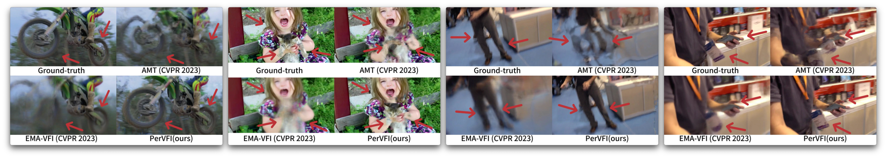

# Perception-Oriented Video Frame Interpolation via Asymmetric Blending [:link:](https://openaccess.thecvf.com/content/CVPR2024/html/Wu_Perception-Oriented_Video_Frame_Interpolation_via_Asymmetric_Blending_CVPR_2024_paper.html)

[Guangyang Wu](https://scholar.google.com/citations?user=lgBxzzcAAAAJ&hl=en),
[Xin Tao](https://scholar.google.com/citations?hl=en&user=sQ30WyUAAAAJ),
[Changlin Li](https://scholar.google.com/citations?hl=en&user=wOQjqCMAAAAJ),
[Wenyi Wang](https://scholar.google.com/citations?user=K4wurXEAAAAJ&hl=en),
[Xiaohong Liu](https://scholar.google.com/citations?user=Tq2hoMQAAAAJ&hl=en),
[Qingqing Zheng](https://scholar.google.com/citations?hl=en&user=V3cdGQcAAAAJ)

**In CVPR 2024**

This repository represents the official implementation of the paper titled "Perception-Oriented Video Frame Interpolation via Asymmetric Blending", also denoted as "PerVFI".

[](https://mulns.github.io/pervfi-page/)
[](https://openaccess.thecvf.com/content/CVPR2024/papers/Wu_Perception-Oriented_Video_Frame_Interpolation_via_Asymmetric_Blending_CVPR_2024_paper.pdf)
[](https://huggingface.co/Mulns/PerVFI-v1-0)
[](https://www.apache.org/licenses/LICENSE-2.0)
<!-- [-Space-yellow)](https://huggingface.co/spaces/prs-eth/marigold-lcm) -->
<!-- [-Model-green)](https://huggingface.co/prs-eth/marigold-lcm-v1-0)  -->
<!-- [](https://colab.research.google.com/drive/12G8reD13DdpMie5ZQlaFNo2WCGeNUH-u?usp=sharing) -->
<!-- [](https://github.com/prs-eth/Marigold) -->
<!-- []() -->
<!-- []() -->

We present PerVFI, a novel paradigm for perception-oriented video frame interpolation.

- **Asymmetric synergistic blending scheme**: reduce blurry and ghosting effects derived from unavoidable motion error.
- **Generative model as decoder**: reconstruct results sampled from a distribution to resolve temporal supervision misalignment during training.
- **Future:** network structure can be meticulously optimized to improve efficiency and performance in the future. 




## 📢 News
<!-- 2024-05-28: Training code is released.<br>
2024-03-23: Added [LCM v1.0](https://huggingface.co/prs-eth/marigold-lcm-v1-0) for faster inference - try it out at <a href="https://huggingface.co/spaces/prs-eth/marigold-lcm"></a><br>
2024-03-04: Accepted to CVPR 2024. <br>
2023-12-22: Contributed to Diffusers [community pipeline](https://github.com/huggingface/diffusers/tree/main/examples/community#marigold-depth-estimation). <br>
2023-12-19: Updated [license](LICENSE.txt) to Apache License, Version 2.0.<br>
2023-12-08: Added
<a href="https://huggingface.co/spaces/toshas/marigold"></a> - try it out with your images for free!<br>
2023-12-05: Added <a href="https://colab.research.google.com/drive/12G8reD13DdpMie5ZQlaFNo2WCGeNUH-u?usp=sharing"></a> - dive deeper into our inference pipeline!<br> -->

2024-6-13: Paper Accepted! <a href="https://openaccess.thecvf.com/content/CVPR2024/papers/Wu_Perception-Oriented_Video_Frame_Interpolation_via_Asymmetric_Blending_CVPR_2024_paper.pdf"></a>. Release the inference code (this repository).

2024-6-1: Added arXiv version: <a href="https://arxiv.org/abs/2404.06692"></a>. 

## ∞ TODO
- :exclamation: 🔜 Inference code for customized flow estimator.
- :exclamation: Release VFI-Benchmark, a codebase reproducing all scores listed in paper (*this will take some time, as we are committed to providing a modularized and detailed implementation*).
- 🔜 Google Colab demo.
- 🔜 Online interactive demo.
- Hugging Face Space (optional).
- Add GIFs in page for better visualization.


## 🚀 Usage

**We offer several ways to interact with PerVFI**:

<!-- 1. We integrated [Marigold Pipelines into diffusers 🧨](https://huggingface.co/docs/diffusers/api/pipelines/marigold). Check out many exciting usage scenarios in [this diffusers tutorial](https://huggingface.co/docs/diffusers/using-diffusers/marigold_usage).

1. A free online interactive demo is available here: <a href="https://huggingface.co/spaces/prs-eth/marigold-lcm"></a> (kudos to the HF team for the GPU grant) -->

1. Run the demo locally (requires a GPU and Anaconda, see [Installation Guide](https://conda.io/projects/conda/en/latest/user-guide/install/index.html)). Local development instructions with this codebase are given below.
1. Extended demo on Google Colab (coming soon).
1. Online interactive demo (coming soon).

<!-- 2. Extended demo on a Google Colab: <a href="https://colab.research.google.com/drive/12G8reD13DdpMie5ZQlaFNo2WCGeNUH-u?usp=sharing"></a> -->


## 🛠️ Setup

The inference code was tested on:

- Ubuntu 22.04 LTS, Python 3.10.12, CUDA 11.7, GeForce RTX 4090
- MacOS 14.2, Python 3.10.12, M1 16G

### 🪧 A Note for Windows users

We recommend running the code in WSL2:

1. Install WSL following [installation guide](https://learn.microsoft.com/en-us/windows/wsl/install#install-wsl-command).
1. Install CUDA support for WSL following [installation guide](https://docs.nvidia.com/cuda/wsl-user-guide/index.html#cuda-support-for-wsl-2).
1. Find your drives in `/mnt/<drive letter>/`; check [WSL FAQ](https://learn.microsoft.com/en-us/windows/wsl/faq#how-do-i-access-my-c--drive-) for more details. Navigate to the working directory of choice. 

### 📦 Repository

Clone the repository (requires git):

```bash
git clone https://github.com/mulns/PerVFI.git
cd PerVFI
```

### 💻 Dependencies

We provide several ways to install the dependencies.

1. **Using [Conda](https://conda.io/projects/conda/en/latest/user-guide/tasks/manage-environments.html)**. 

    Windows users: Install the Linux version into the WSL.

    After the installation, create the environment and install dependencies into it:

    ```bash
    conda env create -f environment.yaml
    conda activate pervfi
    ```

2. **Using pip:** 
    Alternatively, create a Python native virtual environment and install dependencies into it:

    ```bash
    python -m venv venv/pervfi
    source venv/pervfi/bin/activate
    pip install -r requirements.txt
    ```

Keep the environment activated before running the inference script. 
Activate the environment again after restarting the terminal session.

## 🏃 Testing on your video

### 📷 Prepare video sequences

Place your video images in a directory, for example, under `input/in-the-wild_example`, and run the following inference command.

### ⬇ Download Checkpoints

Download [pre-trained models](https://huggingface.co/Mulns/PerVFI-v1-0) and place them to folder `checkpoints`. This includes checkpoints for various optical flow estimators. You can choose one for simple use or all for comparison.

### 🚀 Run inference

The [Default checkpoint](https://huggingface.co/Mulns/PerVFI-v1-0/blob/main/PerVFI/v00.pth) is trained only using Vimeo90K dataset. 
```bash
 python infer_video.py -m [OFE]+pervfi -data input -fps [OUT_FPS]
```
> **NOTE:** `OFE` is a placeholder for optical flow estimator name. In this repo, we support [RAFT](), [GMA](), [GMFlow](). You can also use your preferred flow estimator (future feature). `OUT_FPS` is a placeholder for frame rate (default to 10) of output video (maybe save with images).

The [Vb checkpoint](https://huggingface.co/Mulns/PerVFI-v1-0/blob/main/PerVFI/vb.pth) (faster) replaces the normalizing flow-generator with a multi-scale decoder to achieve faster inference speed, though with a compromise in perceptual quality:

```bash
 python infer_video.py -m [OFE]+pervfi-vb -data input -fps [OUT_FPS]
 ```

You can find all results in `output`. **Enjoy**!
<!-- 
### ⬇ Checkpoint cache

By default, the [checkpoint](https://huggingface.co/prs-eth/marigold-v1-0) is stored in the Hugging Face cache.
The `HF_HOME` environment variable defines its location and can be overridden, e.g.:

```bash
export HF_HOME=$(pwd)/cache
```

Alternatively, use the following script to download the checkpoint weights locally:

```bash
bash script/download_weights.sh marigold-v1-0
# or LCM checkpoint
bash script/download_weights.sh marigold-lcm-v1-0
```

At inference, specify the checkpoint path:

```bash
python run.py \
    --checkpoint checkpoint/marigold-v1-0 \
    --denoise_steps 50 \
    --ensemble_size 10 \
    --input_rgb_dir input/in-the-wild_example\
    --output_dir output/in-the-wild_example
``` -->

## 🦿 Evaluation on test datasets <a name="evaluation"></a>

Will be included in VFI-Benchmark (currently under crafting).

<!-- 
Install additional dependencies:

```bash
pip install -r requirements+.txt -r requirements.txt
```

Set data directory variable (also needed in evaluation scripts) and download [evaluation datasets](https://share.phys.ethz.ch/~pf/bingkedata/marigold/evaluation_dataset) into corresponding subfolders:

```bash
export BASE_DATA_DIR=<YOUR_DATA_DIR>  # Set target data directory

wget -r -np -nH --cut-dirs=4 -R "index.html*" -P ${BASE_DATA_DIR} https://share.phys.ethz.ch/~pf/bingkedata/marigold/evaluation_dataset/
```

Run inference and evaluation scripts, for example:

```bash
# Run inference
bash script/eval/11_infer_nyu.sh

# Evaluate predictions
bash script/eval/12_eval_nyu.sh
```

Note: although the seed has been set, the results might still be slightly different on different hardware. -->

## 🏋️ Training

Comming Soon~
<!-- 
Based on the previously created environment, install extended requirements:

```bash
pip install -r requirements++.txt -r requirements+.txt -r requirements.txt
```

Set environment parameters for the data directory:

```bash
export BASE_DATA_DIR=YOUR_DATA_DIR  # directory of training data
export BASE_CKPT_DIR=YOUR_CHECKPOINT_DIR  # directory of pretrained checkpoint
```

Download Stable Diffusion v2 [checkpoint](https://huggingface.co/stabilityai/stable-diffusion-2) into `${BASE_CKPT_DIR}`

Prepare for [Hypersim](https://github.com/apple/ml-hypersim) and [Virtual KITTI 2](https://europe.naverlabs.com/research/computer-vision/proxy-virtual-worlds-vkitti-2/) datasets and save into `${BASE_DATA_DIR}`. Please refer to [this README](script/dataset_preprocess/hypersim/README.md) for Hypersim preprocessing.

Run training script

```bash
python train.py --config config/train_marigold.yaml
```

Resume from a checkpoint, e.g.

```bash
python train.py --resume_from output/marigold_base/checkpoint/latest
```

Evaluating results

Only the U-Net is updated and saved during training. To use the inference pipeline with your training result, replace `unet` folder in Marigold checkpoints with that in the `checkpoint` output folder. Then refer to [this section](#evaluation) for evaluation.

**Note**: Although random seeds have been set, the training result might be slightly different on different hardwares. It's recommended to train without interruption. -->

## ✏️ Contributing

Please refer to [this](CONTRIBUTING.md) instruction.

<!-- ## 🤔 Troubleshooting

| Problem                                                                                                                                      | Solution                                                       |
|----------------------------------------------------------------------------------------------------------------------------------------------|----------------------------------------------------------------|
| (Windows) Invalid DOS bash script on WSL                                                                                                     | Run `dos2unix <script_name>` to convert script format          |
| (Windows) error on WSL: `Could not load library libcudnn_cnn_infer.so.8. Error: libcuda.so: cannot open shared object file: No such file or directory` | Run `export LD_LIBRARY_PATH=/usr/lib/wsl/lib:$LD_LIBRARY_PATH` | -->


## 🎓 Citation

Please cite our paper:

```bibtex
@InProceedings{Wu_2024_CVPR,
    author    = {Wu, Guangyang and Tao, Xin and Li, Changlin and Wang, Wenyi and Liu, Xiaohong and Zheng, Qingqing},
    title     = {Perception-Oriented Video Frame Interpolation via Asymmetric Blending},
    booktitle = {Proceedings of the IEEE/CVF Conference on Computer Vision and Pattern Recognition (CVPR)},
    month     = {June},
    year      = {2024},
    pages     = {2753-2762}
}
```

## 🎫 License

This work is licensed under the Apache License, Version 2.0 (as defined in the [LICENSE](LICENSE.txt)).

By downloading and using the code and model you agree to the terms in the  [LICENSE](LICENSE.txt).

[](https://www.apache.org/licenses/LICENSE-2.0)